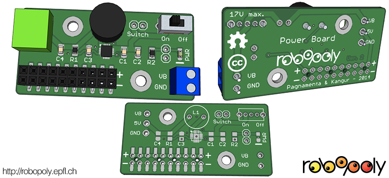
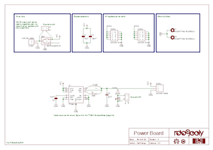
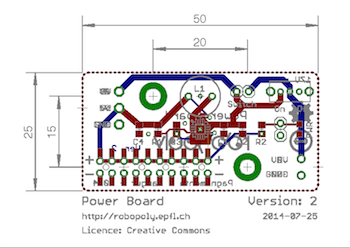

# Power Board

The Power board is intended to work with the EPFL Robotics club robotics platform [PRismino](https://github.com/Robopoly/PRismino) and the [Robopoly shield](https://github.com/Robopoly/Robopoly-Shield).

## Characteristics

The Power board provides a constant 5V up to 3A. The absolute maximum input rating for the regulator is 17V, but the actual limiting factor is the H-bridge on the [Robopoly shield](https://github.com/Robopoly/Robopoly-Shield) that has an absolute maximum rating of 11.8V. It's a switched-mode step-down power supply circuit.

It features a standard 10 pin female rack to connect components and an on-off switch. It has a very low dropout voltage allowing it to output 5V while the input is at about 5V too.

There's a footprint in parallel with the power switch to add an external switch if the one on the board isn't accessible.

A LED indicates the power state of the board, like with the switch there's a footprint to solder the wires or a connector to a LED away from the board, but if it's used the on-board LED has to be removed.

The regulator is the [TPS62133](http://www.ti.com/product/tps62133) step-down converter. The circuit on the board is the same as on figure 43 in the datahsheet (page 24).

This board has been tested under high load and has proven itself to be reliable, it has built-in short-circuit detection and thermal shutdown. Here's a [video of the thermal shutdown test under high load](http://www.youtube.com/watch?v=QFXuxgbKgFs).

**NOTE**: in almost all cases this board works as intended, but it has happened that the regulator doesn't work or output the right voltage, we haven't been able to diagnose the problem, but it might be because of bad electical connections underneath the regulator. Always check the output voltage and make sure you don't invert VCC and GND power signals as it may damage the regulator.

## Electrical schematic and PCB

## Assembly

The assembly of the Power board is [documented on the Robopoly's website](http://robopoly.epfl.ch/prisme/assemblage).

The QFN regulator is hard to solder manually, but it can be done with the right tools.

## Component list

The regulated power rack can be SMD or through-hole type. With the SMD variant it is possible to plug devices from under the board.

| Part                                             | Reference   | Quantity |
| ------------------------------------------------ | ----------- | -------- |
| PCB                                              |             | 1        |
| Power rack 2X10 female pins (through-hole)       | 4UCON-07870 | 1        |
| Power rack 2X10 female pins (SMD)                | 4UCON-17654 | 0        |
| On/off slide switch                              |             | 1        |
| Step down regulator                              | TPS62133    | 1        |
| 3.3nF 0805 capacitor                             |             | 1        |
| 22uF 0805 capacitor                              |             | 1        |
| 2.2uH inductor                                   |             | 1        |
| 100K 0805 resistor                               |             | 1        |
| 1K 0805 resistor                                 |             | 1        |
| SMD LED 0805                                     |             | 1        |
| 10uF, 20V min, 0805 capacitor                    |             | 1        |
| 100nF, 20V min, 0805 capacitor                   |             | 1        |
| 2 pin power input connector                      | 4UCON-19963 | 1        |
| 3 pin power connector male                       | 4UCON-19836 | 1        |
| 3 pin power connector female                     | 4UCON-19841 | 1        |

## CAD files

The CAD file is in [Google Sketchup](http://www.sketchup.com) format. Generated with [eagleUp](http://eagleup.wordpress.com/), a plugin that exports the board from [Eagle CAD](http://www.cadsoftusa.com) and imports it to Google Sketchup.

All additional files needed to generate the board are in the [Robopoly Eagle CAD library and SketchUp files](https://github.com/Robopoly/Robopoly-Eagle-library) project.

## Version log

### 2.0 (2014-02-23)

* Rounded corners.
* Moved the output connector a more inside the PCB.
* Changed the regulator, external LED and parallel power switch footprints.
* Updated CAD and Gerber files.
* Added component list.

### 1.0 (2013-07-12)

* Initial version.

## Licence

The Robopoly shield is published under [Creative Commons Attribution license](http://creativecommons.org/licenses/by/3.0/).

